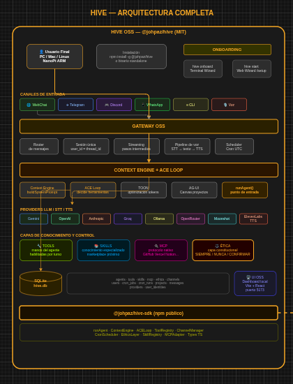

# Hive 🐝

> Tu colmena de agentes IA. Local-first. Multi-canal. Open source. Construido desde Colombia para el mundo.

[](https://www.npmjs.com/package/@johpaz/hive-agents)
[](https://opensource.org/licenses/MIT)
[](https://www.npmjs.com/package/@johpaz/hive-agents)
[](https://github.com/johpaz/hive)

---

## ¿Qué es Hive?

Hive es un Gateway de IA Orquestado — un Enjambre de Agentes Especializados que trabajan juntos bajo la coordinación de un gateway central. A diferencia de un asistente personal único, Hive implementa una arquitectura de enjambre donde múltiples agentes especializados trabajan en equipo.

**El problema que resolvemos**: Necesitas un asistente de IA que funcione en múltiples canales (Telegram, Discord, WhatsApp), que pueda ejecutar tareas automáticamente, que respete tu privacidad con datos locales, y que sea extensible con herramientas propias.

---

## Por dentro

51.937 líneas de TypeScript. Sin frameworks de agentes. Sin LangChain. Sin abstracciones intermedias. Todo construido desde cero sobre Bun + SQLite.

```
Language          files     blank   comment      code
─────────────────────────────────────────────────────
TypeScript          434      7671      2683     51937   ← motor, gateway, canales, UI
Markdown             45      2225         0      8233
JSON                 15         5         0       575
CSS                   1       141        29       450
YAML                  2        35        11       197
Shell                 2        14         5        61
Dockerfile            1        19        10        38
─────────────────────────────────────────────────────
TOTAL               504     10119      2741     61546
```

La imagen Docker pesa ~120 MB. El bundle npm pesa ~12 MB. El binario standalone ~50 MB. Todo el runtime cabe en una Raspberry Pi Zero 2W con 512 MB de RAM.

---

## Instalación

### Prerequisito — Bun

Hive requiere [Bun](https://bun.sh) como runtime para las opciones de binario y npm. Docker no lo requiere.

```bash
curl -fsSL https://bun.sh/install | bash
source ~/.bashrc   # o reinicia la terminal
bun --version      # verifica que quedó instalado
```

---

Elige la opción que mejor se adapte a tu caso:

| | Docker | Binario | npm / bun |
|---|---|---|---|
| Requiere | Docker | Bun | Bun |
| Setup | 1 comando | descarga + ejecuta | `bun install -g @johpaz/hive-agents` |
| Actualizar | `docker compose pull` | descarga nueva versión | `bun install -g @johpaz/hive-agents` |
| Ideal para | Raspberry Pi, VPS, laptop vieja, VM | uso personal, USB | desarrolladores |
| Abre navegador | automático (con GUI) / por IP (headless) | automático | automático |
| Tamaño | ~120 MB imagen | ~50 MB | ~12 MB bundle |

---

### Opción 1 — Docker (Recomendada para servidores y VPS)

La forma más rápida. Sin instalar Node, Bun ni dependencias. Solo necesitas Docker.

#### Laptop, PC o VM con interfaz gráfica

Un solo comando que levanta todo y abre el navegador automáticamente:

```bash
curl -O https://raw.githubusercontent.com/johpaz/hive/master/docker-compose.yml
curl -O https://raw.githubusercontent.com/johpaz/hive/master/hive-docker.sh
chmod +x hive-docker.sh
./hive-docker.sh
```

El script levanta el contenedor, espera a que el gateway esté listo y abre el navegador directamente en `/setup` (primera vez) o en el dashboard (si ya está configurado).

#### Raspberry Pi, VPS o servidor headless

Sin interfaz gráfica, usa Docker Compose directamente:

```bash
curl -O https://raw.githubusercontent.com/johpaz/hive/master/docker-compose.yml
docker compose up -d
```

Luego accede desde cualquier equipo en la misma red usando la IP del servidor:

```
http://<ip-del-servidor>:18790
```

Para conocer la IP del servidor:

```bash
ip a | grep "inet " | grep -v 127.0.0.1
```

> **Raspberry Pi tip:** si usas el mismo Pi para todo, `http://raspberrypi.local:18790` suele funcionar sin necesitar la IP.

**Con un solo comando** (sin Compose):

```bash
docker run -d \
  -p 18790:18790 \
  -v hive-data:/root/.hive \
  --name hive \
  --restart unless-stopped \
  johpaz/hive:0.0.22
```

**Variables de entorno disponibles:**

| Variable | Default | Descripción |
|----------|---------|-------------|
| `HIVE_HOST` | `0.0.0.0` | Interfaz de red donde escucha el gateway |
| `HIVE_PORT` | `18790` | Puerto del gateway |
| `HIVE_AUTH_TOKEN` | — | Token de autenticación (opcional) |
| `HIVE_LOG_LEVEL` | `info` | Nivel de logs (`debug`, `info`, `warn`, `error`) |

**Actualizar a la última versión:**

```bash
docker compose pull        # descarga la imagen más reciente de Docker Hub
docker compose up -d       # reinicia el contenedor con la nueva imagen
```

Los datos (BD, config, logs) se persisten en el volumen `hive-data` — actualizar no borra tu configuración.

**Ver logs en tiempo real:**

```bash
docker compose logs -f hive
```

---

#### Acceso a archivos del sistema desde Docker

El `docker-compose.yml` monta automáticamente tu home completo dentro del contenedor — sin configuración adicional ni variables de entorno:

| Sistema | Path del host | Path dentro del contenedor |
|---------|--------------|---------------------------|
| **Linux** | `/home/tu_usuario` | `/host/home` |
| **macOS** | `/Users/tu_usuario` | `/host/home` |
| **Windows** | `C:\Users\tu_usuario` | `/host/home` |

La variable `${HOME}` la detecta el shell automáticamente al hacer `docker compose up`.

**Configurar el workspace en la UI**

1. Abre la UI: `http://localhost:18790`
2. Ve a **Configuración del Agente** (o crea tu agente si es la primera vez)
3. En el campo **Workspace**, configura el subdirectorio que quieres:
   - `/host/home` — todo tu home
   - `/host/home/Documentos` — solo carpeta Documentos
   - `/host/home/Proyectos` — solo carpeta Proyectos

El path se guarda en la base de datos SQLite (`agents.workspace`). A partir de ese momento, todas las operaciones de filesystem del agente están restringidas a ese directorio por seguridad.

**Ejemplo de uso:**

```
Usuario: "Crea un archivo README.md en mi carpeta Proyectos"
Agente:  → Escribe en: /host/home/Proyectos/README.md
         → Que se traduce a: ~/Proyectos/README.md (en tu host)
```

> **Nota de seguridad:** El agente solo puede acceder al path que configures como workspace. Si configuras `/host/home/Documentos`, no podrá leer `/host/home/Proyectos`.

---

#### Docker portable — USB o disco externo

Docker también puede viajar en una USB. La clave es exportar la imagen como archivo `.tar` y montar el volumen de datos desde la USB en vez de un volumen gestionado por Docker.

**Paso 1 — Exportar la imagen a un archivo**

En el equipo donde tienes conexión a internet:

```bash
# Descargar la imagen si no la tienes
docker pull johpaz/hive:0.0.22

# Exportar a archivo tar (cabe en cualquier USB de 512 MB+)
docker save johpaz/hive:0.0.22 -o /media/usb/hive-image.tar
```

**Paso 2 — Crear la estructura en la USB**

```
/usb/
├── hive-image.tar         ← imagen Docker exportada (~120 MB)
├── docker-compose.yml     ← archivo de configuración
└── datos/                 ← directorio de datos de Hive (se crea al primer arranque)
    └── hive.db
```

Crea el `docker-compose.yml` en la USB con el volumen apuntando a la USB:

```yaml
services:
  hive:
    image: johpaz/hive:0.0.22
    ports:
      - "18790:18790"
    volumes:
      - ./datos:/root/.hive
    restart: unless-stopped
```

> La clave es `./datos:/root/.hive` — monta la carpeta `datos/` relativa al `docker-compose.yml`, que está en la USB. Así los datos viajan con la USB, no quedan en el equipo.

**Paso 3 — Cargar y ejecutar en cualquier equipo con Docker**

```bash
# 1. Cargar la imagen desde el archivo (sin internet)
docker load -i /media/usb/hive-image.tar

# 2. Ir al directorio de la USB
cd /media/usb

# 3. Levantar
docker compose up -d
```

Abre `http://localhost:18790` en el navegador. Si es la primera vez en ese equipo, muestra el wizard de setup. Si la USB ya tiene datos, carga tu agente directamente.

**Detener y llevar la USB a otro equipo:**

```bash
# Detener el contenedor
docker compose down

# En el otro equipo, volver al Paso 3
```

> **Nota para Windows:** Docker Desktop usa rutas como `D:\` para la USB. Ajusta el volumen en el `docker-compose.yml` a la letra de tu unidad:
> ```yaml
> volumes:
>   - D:\datos:/root/.hive
> ```

**Backup de los datos del contenedor:**

```bash
# Copiar la BD desde la USB a tu máquina
cp /media/usb/datos/hive.db ~/backup-hive-$(date +%Y%m%d).db

# Restaurar
cp ~/backup-hive-20260312.db /media/usb/datos/hive.db
```

**Actualizar la imagen en la USB:**

```bash
# En un equipo con internet
docker pull johpaz/hive:latest
docker save johpaz/hive:latest -o /media/usb/hive-image.tar

# Actualizar el tag en docker-compose.yml
# Luego en cualquier equipo:
docker load -i /media/usb/hive-image.tar
docker compose up -d
```

---

### Opción 2 — Binario standalone (Sin dependencias)

Descarga un ejecutable único para tu plataforma. No requiere Node, Bun ni Docker. Al ejecutarlo, **el navegador se abre automáticamente** en `/setup` (primera vez) o en el dashboard.

#### Dónde descargar

**Desde la web** — [hiveagents.io](https://www.hiveagents.io/#installation)
La página detecta tu sistema operativo automáticamente y muestra el botón de descarga correcto. También puedes seleccionar otra plataforma desde el selector.

**Desde GitHub Releases** — [github.com/johpaz/hive/releases/latest](https://github.com/johpaz/hive/releases/latest)
Descarga manual de cualquier plataforma o versión específica.

| Plataforma | Archivo | Descarga directa |
|------------|---------|------------------|
| Linux x64 | `hive-v0.0.22-linux-x64` | [Descargar](https://github.com/johpaz/hive/releases/latest/download/hive-v0.0.22-linux-x64) |
| Linux ARM64 (Raspberry Pi, etc.) | `hive-v0.0.22-linux-arm64` | [Descargar](https://github.com/johpaz/hive/releases/latest/download/hive-v0.0.22-linux-arm64) |
| macOS Apple Silicon (M1/M2/M3/M4) | `hive-v0.0.22-macos-arm64` | [Descargar](https://github.com/johpaz/hive/releases/latest/download/hive-v0.0.22-macos-arm64) |
| macOS Intel | `hive-v0.0.22-macos-x64` | [Descargar](https://github.com/johpaz/hive/releases/latest/download/hive-v0.0.22-macos-x64) |
| Windows x64 | `hive-v0.0.22-windows-x64.exe` | [Descargar](https://github.com/johpaz/hive/releases/latest/download/hive-v0.0.22-windows-x64.exe) |

> Los links anteriores siempre apuntan a la última versión publicada. Si necesitas una versión específica, visita la [página de releases](https://github.com/johpaz/hive/releases).

---

#### Linux x64 / ARM64

```bash
# 1. Descargar el binario (reemplaza "linux-x64" por "linux-arm64" si es ARM)
curl -L -o hive https://github.com/johpaz/hive/releases/latest/download/hive-v0.0.22-linux-x64

# 2. Dar permisos de ejecución
chmod +x hive

# 3. Descargar la UI web
curl -L https://github.com/johpaz/hive/releases/latest/download/ui-dist.tar.gz \
  | tar -xz --one-top-level=ui-dist

# 4. Colocar la UI donde Hive la espera
mkdir -p ~/.hive/ui
cp -r ui-dist/* ~/.hive/ui/

# 5. Ejecutar
./hive start
```

El gateway levanta en `http://localhost:18790`. El navegador se abre automáticamente.

**Agregar al PATH (opcional)** para ejecutar `hive` desde cualquier directorio:

```bash
sudo mv hive /usr/local/bin/hive
hive start
```

---

#### macOS — Apple Silicon (M1/M2/M3/M4)

```bash
# 1. Descargar
curl -L -o hive https://github.com/johpaz/hive/releases/latest/download/hive-v0.0.22-macos-arm64

# 2. Dar permisos de ejecución
chmod +x hive

# 3. Quitar la cuarentena de Gatekeeper (necesario en todos los binarios descargados)
xattr -d com.apple.quarantine hive

# 4. Descargar la UI
curl -L https://github.com/johpaz/hive/releases/latest/download/ui-dist.tar.gz \
  | tar -xz --one-top-level=ui-dist
mkdir -p ~/.hive/ui && cp -r ui-dist/* ~/.hive/ui/

# 5. Ejecutar
./hive start
```

> **¿Por qué el paso `xattr`?** macOS bloquea binarios descargados de internet que no tienen firma de Apple. El comando `xattr -d com.apple.quarantine` elimina esa restricción. Si lo omites, verás el error: _"hive no se puede abrir porque Apple no puede comprobar que no contiene software malicioso"_.
>
> Alternativa: en Finder, haz clic derecho sobre el archivo → **Abrir** → **Abrir** de nuevo en el diálogo. Esto también lo desbloquea.

> **Error "there is no application set to open this document"**
> El binario es un ejecutable de terminal — **no se puede abrir con doble clic desde Finder**. Siempre se ejecuta desde Terminal con `./hive start`. Si aparece ese mensaje al hacer doble clic, ignóralo y usa Terminal.
>
> Si después del `xattr` el error persiste, ve a **Ajustes del Sistema → Privacidad y Seguridad** y haz clic en **"Abrir de todas formas"**.

**Agregar al PATH:**

```bash
sudo mv hive /usr/local/bin/hive
hive start
```

---

#### macOS — Intel

Igual que Apple Silicon pero descarga `macos-x64`:

```bash
curl -L -o hive https://github.com/johpaz/hive/releases/latest/download/hive-v0.0.22-macos-x64
chmod +x hive
xattr -d com.apple.quarantine hive
curl -L https://github.com/johpaz/hive/releases/latest/download/ui-dist.tar.gz \
  | tar -xz --one-top-level=ui-dist
mkdir -p ~/.hive/ui && cp -r ui-dist/* ~/.hive/ui/
./hive start
```

---

#### Windows x64

**Paso 1 — Descargar el binario**

Descarga [`hive-v0.0.22-windows-x64.exe`](https://github.com/johpaz/hive/releases/latest/download/hive-v0.0.22-windows-x64.exe) desde GitHub o desde [hiveagents.io](https://www.hiveagents.io/#installation).

**Paso 2 — Windows SmartScreen**

Al ejecutar por primera vez, Windows puede mostrar _"Windows protegió tu PC"_. Es normal para binarios sin firma de código.

1. Haz clic en **"Más información"**
2. Luego en **"Ejecutar de todas formas"**

**Paso 3 — Descargar la UI**

Descarga [`ui-dist.tar.gz`](https://github.com/johpaz/hive/releases/latest/download/ui-dist.tar.gz) y extrae su contenido en:

```
C:\Users\TU_USUARIO\.hive\ui\
```

Puedes usar [7-Zip](https://www.7-zip.org/) o WSL para extraer el `.tar.gz`. Con PowerShell 5+:

```powershell
# Crear la carpeta de destino
New-Item -ItemType Directory -Force -Path "$env:USERPROFILE\.hive\ui"

# Extraer (requiere PowerShell 5+ o Windows 11)
tar -xzf ui-dist.tar.gz -C "$env:USERPROFILE\.hive\ui"
```

**Paso 4 — Ejecutar**

```powershell
.\hive-v0.0.22-windows-x64.exe start
```

El navegador se abre automáticamente en `http://localhost:18790`.

**Agregar al PATH (opcional):**

```powershell
# Mover a una carpeta ya en el PATH, por ejemplo:
Move-Item .\hive-v0.0.22-windows-x64.exe C:\Windows\System32\hive.exe

# Luego ejecutar desde cualquier lugar:
hive start
```

---

#### ¿Dónde se guardan los datos?

Todos los datos (base de datos, configuración, logs) se guardan en `~/.hive/`:

```
~/.hive/                         # Windows: C:\Users\TU_USUARIO\.hive\
├── data/
│   └── hive.db        ← SQLite (agentes, conversaciones, config)
├── ui/                ← archivos de la interfaz web
├── logs/
│   └── gateway.log
└── gateway.pid
```

**Variables de entorno disponibles:**

| Variable | Default | Descripción |
|----------|---------|-------------|
| `HIVE_HOME` | `~/.hive` | Directorio raíz de datos |
| `HIVE_PORT` | `18790` | Puerto del gateway |
| `HIVE_HOST` | `127.0.0.1` | Interfaz de red |
| `HIVE_UI_DIR` | `~/.hive/ui` | Ruta alternativa para la UI |

---

#### Uso portable — USB o disco externo

El binario standalone es ideal para llevarlo en una USB. Tu agente viaja contigo con toda su memoria, historial y configuración.

**Estructura recomendada en la USB:**

```
/usb/
├── hive                  ← binario ejecutable
├── ui/                   ← archivos de la UI (extraídos de ui-dist.tar.gz)
└── datos/                ← directorio de datos (se crea automáticamente)
    ├── data/hive.db
    └── ...
```

**Preparar la USB:**

```bash
cp hive-v0.0.22-linux-x64 /media/usb/hive
chmod +x /media/usb/hive
cp -r ui-dist/* /media/usb/ui/

# (Opcional) llevar los datos existentes
cp -r ~/.hive/data /media/usb/datos/
```

**Ejecutar desde la USB:**

```bash
# Linux
HIVE_HOME=/media/usb/datos HIVE_UI_DIR=/media/usb/ui /media/usb/hive start

# macOS
HIVE_HOME=/Volumes/USB/datos HIVE_UI_DIR=/Volumes/USB/ui /Volumes/USB/hive start
```

**Backup de datos:**

```bash
cp ~/.hive/data/hive.db ~/backup-hive-$(date +%Y%m%d).db
```

---

### Opción 3 — bun / npm (Para uso en máquinas con Bun)

> Requiere Bun instalado — ver prerequisito al inicio de esta sección.

**Instalación global:**

```bash
bun install -g @johpaz/hive-agents
```

> También funciona con `npm install -g @johpaz/hive-agents`, pero igualmente necesitas Bun instalado — el CLI lo usa como runtime.

**Iniciar:**

```bash
hive start
```

Al arrancar por primera vez, el gateway levanta en `http://localhost:18790` y la UI en un puerto libre (normalmente `5173`). **El navegador se abre automáticamente** en la pantalla de setup.

#### Setup inicial — asistente web

El wizard de configuración tiene 4 pasos:

1. **Providers** — elige tu proveedor de IA (Gemini, Anthropic, OpenAI, Groq, Ollama…) e introduce tu API key.
2. **Tu agente** — nombre, descripción y tono de personalidad.
3. **Ética** — elige las reglas de comportamiento predefinidas.
4. **Canales** — activa WebChat, Telegram o Discord.

Al terminar, el gateway se reinicia automáticamente y el navegador redirige al dashboard.

> Si prefieres configurar sin browser (VPS headless, SSH, etc.):
> ```bash
> hive onboard
> ```

**Comandos útiles:**

```bash
hive status          # estado del gateway
hive logs --follow   # logs en tiempo real
hive stop            # detener el gateway
hive doctor          # diagnóstico del sistema
```

**Actualizar a la última versión:**

```bash
bun install -g @johpaz/hive-agents   # instala la versión más reciente (incluye la UI)
hive stop && hive start
```

**Modo desarrollo** (hot-reload + Vite, para contribuir al proyecto):

```bash
git clone https://github.com/johpaz/hive.git && cd hive
bun install
bun run dev
```

**Migrar datos a otro equipo (portable):**

El ejecutable de Hive queda instalado globalmente en el sistema, pero **todos los datos viven en `~/.hive/`** — agentes, conversaciones, configuración, API keys. Para llevarlos a otro equipo basta con copiar esa carpeta:

```bash
# En el equipo origen — comprimir los datos
tar -czf hive-datos.tar.gz -C ~ .hive

# Copiar a USB, disco externo o transferir por red
cp hive-datos.tar.gz /media/usb/

# En el equipo destino — instalar Hive y restaurar datos
bun install -g @johpaz/hive-agents
tar -xzf /media/usb/hive-datos.tar.gz -C ~

# Arrancar — carga tu agente con toda su memoria
hive start
```

> La carpeta `.hive` contiene la BD SQLite (`data/hive.db`), la UI web (`ui/`) y los logs. No contiene el binario de Hive — ese se reinstala con `bun install -g`.

**Backup rápido solo de la BD:**

```bash
cp ~/.hive/data/hive.db ~/backup-hive-$(date +%Y%m%d).db
```

---

## Los Cuatro Pilares

| Pilar | Descripción |
|-------|-------------|
| **Tools** | 73 herramientas nativas: navegador, sistema de archivos, cron, canvas, Office (PDF/Word/Excel/PowerPoint). |
| **Skills** | 30 habilidades incluidas: búsqueda web, shell, memoria, file manager, gestión de documentos Office. |
| **MCP** | Compatible con Model Context Protocol para extender funcionalidades. |
| **Ética** | Límites claros definidos en ETHICS.md — tu agente siempre sabe qué puede y qué no puede hacer. |

---

## Arquitectura técnica

Hive usa un **Native Agent Loop** propio — sin dependencias de LangGraph ni LangChain. Todo corre sobre Bun + SQLite con cero abstracciones intermedias.



### Loop principal

```
mensaje entrante
  → Context Compiler (compileContext)
      → callLLM()
          → [executeTool() → callLLM()]*
              → respuesta al usuario
```

---

### FASE 3 — Context Compiler

El Context Compiler es el componente central del motor. Se ejecuta antes de cada llamada al modelo y ensambla una "vista mínima" del contexto consultando SQLite directamente. Implementa cuatro estrategias de Context Engineering:

**3.1 — Selección de historial (SELECCIONAR)**
- Conversaciones cortas (< 20 mensajes): pasa todos los mensajes
- Conversaciones largas: usa el resumen de la tabla `summaries` + los últimos N mensajes recientes
- Nunca pasa la conversación cruda completa a modelos con ventana chica

**3.2 — Scratchpad (ESCRIBIR)**
- Carga las notas persistentes del thread actual desde la tabla `scratchpad`
- Las inyecta en el system prompt como "Información conocida sobre esta conversación"
- El agente puede escribir al scratchpad usando la tool `save_note(key, value)`

**3.3 — Playbook del ACE (SELECCIONAR)**
- Busca con FTS5 en la tabla `playbook` usando keywords del mensaje del usuario
- Inyecta máximo 5 reglas relevantes (`active=1`, `helpful_count > harmful_count`)
- Las reglas son aprendidas automáticamente por el Curator del ACE

**3.4 — Selección de tools en tres niveles (SELECCIONAR)**

| Nivel | Operación |
|-------|-----------|
| 1 — Catálogo | `collectNativeTools()` + tools de MCP activos |
| 2 — Agente | `filterToolsByAgent()` — filtra por `tools_json` del agente. `NULL` = todas permitidas |
| 3 — Turno | `selectToolLoadout()` — ALWAYS_INCLUDE + scoring por keywords del mensaje (máx. 20) |

El límite de 20 tools por turno es crítico para modelos locales con recursos limitados. Las tools del `ALWAYS_INCLUDE` siempre están disponibles sin consumir slots opcionales: `cron_add/list/remove/edit`, `project_create/task_create/task_update`, `read/write/edit`, `save_note`, `notify`, `report_progress`, `create_agent`.

**3.5 — Ética (capa constitucional)**
- Carga todas las reglas de la tabla `ethics` — sin filtrar, sin comprimir
- Siempre es el primer bloque del system prompt, en toda llamada al modelo

**Orden de ensamblaje del contexto:**

```
[system prompt]
  1. Reglas de ética (completas, siempre)
  2. Identidad del agente (agents.system_prompt + description)
  3. Hive Capabilities Manifest (hive_capabilities table)
  4. Perfil del usuario (users table)
  5. Reglas del playbook relevantes (FTS5, máx. 5)
  6. Notas del scratchpad (filtradas por thread_id)
  7. Entorno (agent_id, thread_id, fecha/hora local)

[messages]
  8. Resumen del historial (si la conversación es larga)
  9. Mensajes recientes (últimos N)

[tools]
  10. Tools filtradas en tres niveles
```

---

### FASE 4 — Proyectos, Tareas y Workers

El Coordinador puede descomponer problemas complejos en proyectos con tareas paralelas ejecutadas por workers autónomos.

**4.1 — Decisión simple vs proyecto**

El modelo decide en su system prompt:
- **Tarea simple** → el Coordinador la resuelve directamente o despacha a un worker existente
- **Tarea compleja** → crea un proyecto con subtareas y dependencias

**4.2 — Creación de proyecto y asignación de workers**

1. `project_create` — registra el objetivo del proyecto
2. `task_create` — crea cada subtarea con dependencias
3. `find_agent` — busca por FTS5 sobre `name+description` del agente vs la tarea
   - Si existe un worker compatible → `assign_task`
   - Si no → `create_agent` con system prompt y tools necesarios, luego `assign_task`

**4.3 — Ejecución respetando dependencias**

- Tareas sin dependencias (o con dependencias ya `completed`) se ejecutan primero
- Tareas independientes entre sí corren en paralelo (`Promise.all`)
- Si una tarea falla: el Coordinador puede reintentar, reasignar a otro agente, o marcar el proyecto como `failed`

**4.4 — Contexto aislado por worker (AISLAR)**

Cada worker recibe **solo** lo necesario para su tarea:
- Reglas de ética + su system prompt propio
- Descripción de la tarea asignada
- Resultados de las tareas de las que depende

El worker **no** recibe la conversación completa del usuario. Esto mantiene el contexto mínimo y evita contaminación entre agentes.

---

### FASE 5 — ACE (Adaptive Context Engine)

El ACE convierte a Hive en un sistema que aprende automáticamente de sus propias ejecuciones.

**5.1 — Tracer (Generator)**

Después de cada ejecución se guarda automáticamente en la tabla `traces`:
- Qué agente, qué tool, qué recibió, qué produjo
- Si fue exitoso, cuánto tardó, cuántos tokens consumió

Pasivo — no agrega latencia al usuario.

**5.2 — Reflector (análisis periódico)**

Se ejecuta en segundo plano, nunca en el flujo del usuario:
- Trigger: cada 20 trazas nuevas, o por cron periódico
- Le pide al modelo que analice las trazas: patrones de éxito, fallos repetidos, oportunidades de mejora
- Guarda los insights en la tabla `reflections` (incluyendo `ethics_violation` con prioridad máxima)

**5.3 — Curator (playbook + poda de agentes)**

Transforma insights en reglas operativas:
- Si ya existe una regla similar → incrementa `helpful_count` o `harmful_count`
- Si es nueva → la inserta con `confidence` proporcional a cuántas trazas la respaldan
- Si `harmful_count > helpful_count` → marca la regla como `active=0`
- Si hay reglas duplicadas o contradictorias → fusiona o poda

Poda de agentes:
- Workers sin actividad por más de 14 días → `status='archived'`
- Workers con tasa de fallo alta → `archived` + regla en playbook explicando por qué fallaba
- Workers duplicados (skills similares) → archiva el menos exitoso

**Ciclo completo del ACE:**

```
Agentes ejecutan tareas
  → trazas en SQLite
      → Reflector analiza periódicamente
          → Curator actualiza playbook + poda agentes
              → Context Compiler inyecta reglas
                  → Agentes ejecutan mejor la próxima vez
```

---

### FASE 6 — Compaction (compresión de historial)

Mantiene el contexto dentro del presupuesto de tokens del modelo.

**Compresión de conversación (COMPRIMIR)**
- Trigger: cuando el token count acumulado del thread supera el 60% de la ventana del modelo
- Toma todos los mensajes excepto los últimos 5
- El modelo los resume preservando: datos del usuario, decisiones tomadas, resultados de tools, contexto para continuar
- El resumen se guarda en la tabla `summaries`; los mensajes originales permanecen como historial

**Tool result clearing**
- Resultados de tools con más de N turnos de antigüedad → reemplazados por un resumen corto
- Reduce tokens sin perder el registro de que la tool se ejecutó

---

### Providers LLM soportados

Hive llama directamente a los SDKs oficiales de cada provider:

| Provider | SDK | Modelos ejemplo |
|----------|-----|-----------------|
| Google Gemini | `@google/genai` | gemini-2.5-flash, gemini-2.0-flash |
| Anthropic | `@anthropic-ai/sdk` | claude-sonnet-4-6, claude-opus-4-6 |
| OpenAI | `openai` | gpt-4o, gpt-4.1 |
| Groq | `openai` (compat) | llama-3.3-70b, mixtral-8x7b |
| Mistral AI | `openai` (compat) | mistral-large, codestral |
| DeepSeek | `openai` (compat) | deepseek-chat, deepseek-reasoner |
| Kimi (Moonshot) | `openai` (compat) | moonshot-v1-8k, moonshot-v1-128k |
| Ollama | `openai` (compat) | llama3, qwen2.5, etc. |
| OpenRouter | `openai` (compat) | cualquier modelo de la plataforma |

### Onboarding → System Prompt

Al completar el onboarding, el campo `agents.system_prompt` se genera automáticamente con el nombre, descripción y tono del agente. El tono puede ser: `friendly`, `professional`, `direct` o `casual`.

---

## Browser Automation

Hive incluye 7 tools de browser automation para navegar, extraer datos, interactuar y automatizar sitios web con JavaScript rendering completo.

Usa **Puppeteer + Chromium** — el browser se descarga y gestiona automáticamente al primer uso. No requiere instalación manual ni configuración extra.

### Tools disponibles

| Tool | Descripción |
|------|-------------|
| `browser_navigate` | Navegar a URL y obtener contenido renderizado (soporta JS) |
| `browser_screenshot` | Capturar screenshot de la página (base64 PNG) |
| `browser_click` | Hacer click en elemento (CSS selector) |
| `browser_type` | Escribir texto en campos de formulario |
| `browser_extract` | Extraer datos con selectores CSS o XPath |
| `browser_script` | Ejecutar JavaScript arbitrario en el contexto de la página |
| `browser_wait` | Esperar por elemento o condición antes de continuar |

Todas las tools de browser están **activadas por defecto**. Si el browser no está disponible, las tools fallan gracefully sin afectar el resto de Hive.

### Sin configuración

Al primer uso, Puppeteer descarga automáticamente Chromium en el directorio de caché del sistema. No requiere instalar Chrome, Chromium ni ningún browser externo.

- ✅ **Primera ejecución**: Puppeteer descarga Chromium (~170 MB) automáticamente
- ✅ **Siguientes ejecuciones**: reutiliza el Chromium ya descargado (instantáneo)
- ⚠️ **Sin internet al primer uso**: las browser tools fallan gracefully hasta que el browser esté disponible

### Ejemplo de uso

```typescript
// Navegar a una página con JavaScript rendering
const result = await browser_navigate({
  url: "https://example.com",
  waitFor: ".content-loaded",
  timeout: 30000,
});

// Extraer datos con selector CSS
const links = await browser_extract({
  url: "https://example.com",
  selector: "a[href]",
  attribute: "href",
  all: true,
});

// Tomar screenshot
const screenshot = await browser_screenshot({
  url: "https://example.com",
  fullPage: true,
});

// Ejecutar JavaScript
const data = await browser_script({
  script: `document.querySelector('.price').textContent`,
});
```

---

## Seguridad

| Tema | Resumen |
|------|---------|
| **Autenticación** | Define `HIVE_AUTH_TOKEN` siempre en producción. Sin él, cualquiera que alcance el puerto puede usar el dashboard. |
| **Red** | En VPS o servidores, pon Hive detrás de un reverse proxy con HTTPS y abre solo el puerto `18790`. |
| **Container** | El proceso corre como `root` dentro del contenedor (sin `--privileged`). Migración a usuario no-root pendiente en versiones futuras. |
| **Datos** | Todo se almacena en el volumen `hive-data` / `~/.hive/`. No se envía telemetría a servidores externos. Las API keys se guardan cifradas. |

Consulta [SECURITY.md](SECURITY.md) para instrucciones detalladas de configuración, backup y hardening.

---

## Desarrollo

```bash
# Clonar el repo
git clone https://github.com/johpaz/hive.git
cd hive

# Instalar dependencias
bun install

# Modo desarrollo
bun run dev
```

---

## Contribuir

¿Quieres agregar una nueva funcionalidad? Consulta [CONTRIBUTING.md](CONTRIBUTING.md) para saber exactamente dónde hacer tu cambio.

| Tipo de cambio | Ubicación |
|---------------|-----------|
| Canal nuevo | `packages/core/src/channels/` + registrar en `manager.ts` |
| Tool nativa | `packages/core/src/tools/{categoria}/` + registrar en `tools/index.ts` y `seed.ts` |
| Skill nueva | `packages/skills/src/` |
| MCP nuevo | `packages/core/src/mcp/` |
| Capability en el manifest | tabla `hive_capabilities` vía `seed.ts` |
| Mejora al CLI | `packages/cli/src/commands/` |

Todo en un PR. Una revisión. Un merge.

---

## Links

- 🌐 [hiveagents.io](https://hiveagents.io)
- 💬 [Discord](https://discord.gg/hive)
- 📱 [Telegram](https://t.me/hive_agents)

---

## Licencia

MIT © 2024-2026 Hive Team — Construido con ❤️ desde Colombia
